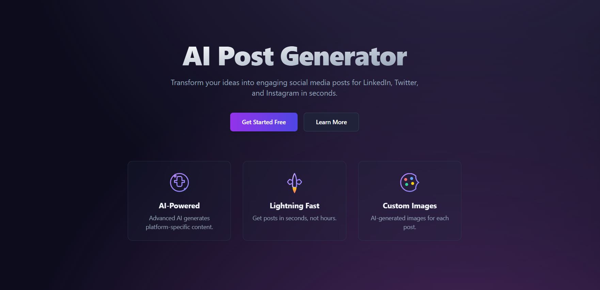
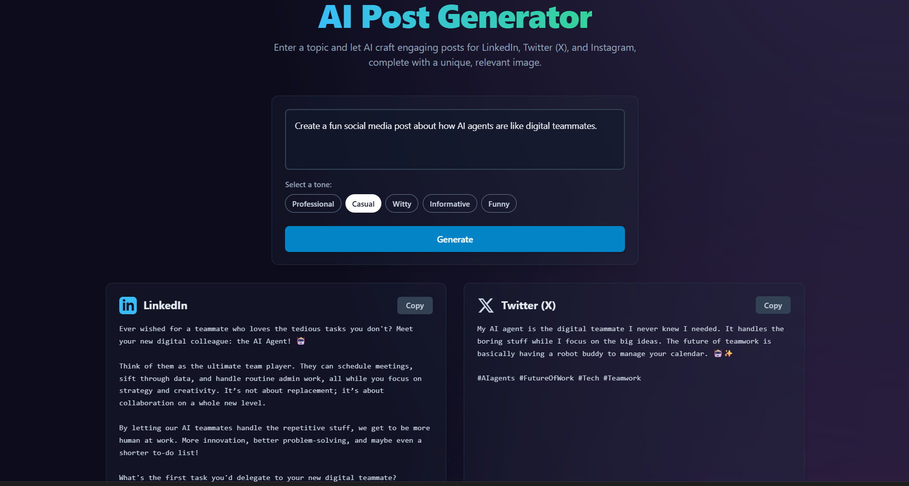
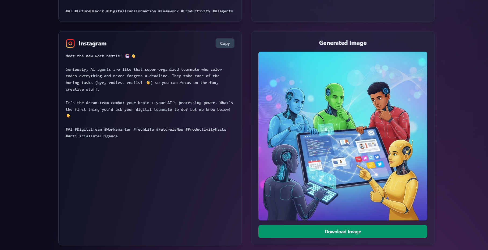

# 🚀 AI Post Generator

<div align="center">
  
</div>

## 📝 About

**AI Post Generator** is a cutting-edge web application that transforms your ideas into engaging social media content for **LinkedIn**, **Twitter (X)**, and **Instagram**. Powered by Google's advanced AI models, it generates platform-optimized posts with custom images in seconds.

## ✨ Key Features

### 🤖 **AI-Powered Content Generation**
- **Multi-Platform Support**: Generate content for LinkedIn, Twitter (X), and Instagram
- **Platform-Optimized**: Each post is tailored to platform-specific character limits and style
- **Smart Hashtags**: Automatically includes relevant and trending hashtags
- **Tone Customization**: Choose from Professional, Casual, Witty, Informative, or Funny tones

### 🎨 **AI Image Generation**
- **Custom Visuals**: Generate unique, relevant images for each post
- **High-Quality Output**: Powered by Google's Imagen 4.0 model
- **Social Media Ready**: Square format (1:1) optimized for all platforms
- **Download Support**: Easy one-click image download

### ⚡ **Lightning-Fast Performance**
- **Real-Time Generation**: Get posts in seconds, not hours
- **Parallel Processing**: Simultaneous text and image generation
- **Responsive Design**: Works seamlessly on desktop and mobile
- **Modern UI**: Beautiful glass-morphism design with smooth animations

## 🖼️ Generated Content Examples

<div align="center">
  <h3>Sample Generated Posts</h3>
  <div style="display: flex; gap: 20px; justify-content: center; flex-wrap: wrap;">
    
    
  </div>
</div>

## 🔧 Tech Stack

- **Frontend**: React 19.2.0 + TypeScript
- **Build Tool**: Vite 6.2.0
- **Styling**: Tailwind CSS
- **Animations**: Framer Motion
- **AI Integration**: Google Gemini AI
- **Icons**: Custom SVG Components

## 🚀 Getting Started

### Prerequisites
- **Node.js** (v16 or higher)
- **GEMINI_API_KEY** from Google AI Studio

### Installation

1. **Clone the repository**
   ```bash
   git clone <repository-url>
   cd ai-post-generator
   ```

2. **Install dependencies**
   ```bash
   npm install
   ```

3. **Set up environment variables**
   
   Create a `.env.local` file in the root directory:
   ```env
   GEMINI_API_KEY=your_gemini_api_key_here
   ```
   
   > ⚠️ **IMPORTANT**: You need a **GEMINI_API_KEY** to use the image generation feature. Without this API key, the application cannot generate images or text content.

4. **Start the development server**
   ```bash
   npm run dev
   ```

5. **Open your browser**
   Navigate to `http://localhost:3000`

## 🔑 API Key Setup

### Getting Your GEMINI_API_KEY

1. Visit [Google AI Studio](https://ai.studio.google/)
2. Sign in with your Google account
3. Create a new API key
4. Copy the key and add it to your `.env.local` file

> 🚨 **CRITICAL**: The **GEMINI_API_KEY** is required for:
> - Text content generation (LinkedIn, Twitter, Instagram posts)
> - AI image generation using Imagen 4.0
> - All AI-powered features

## 📱 How to Use

1. **Enter Your Topic**: Type any topic or idea you want to create posts about
2. **Select Tone**: Choose from 5 different tone options
3. **Generate Content**: Click "Generate" to create posts for all platforms
4. **Copy & Download**: Copy text content and download generated images
5. **Share**: Use the generated content across your social media platforms

## 🎯 Supported Platforms

| Platform | Character Limit | Style | Features |
|----------|----------------|-------|----------|
| **LinkedIn** | ~3000 chars | Professional | Business-focused content with industry hashtags |
| **Twitter (X)** | 280 chars | Concise | Short, punchy posts with trending hashtags |
| **Instagram** | ~2200 chars | Visual | Emoji-rich captions with lifestyle hashtags |

## 🛠️ Development

### Available Scripts

```bash
# Start development server
npm run dev

# Build for production
npm run build

# Preview production build
npm run preview
```


## 🌟 Features in Detail


### **Advanced Image Generation**
- Uses Google's Imagen 4.0 for high-quality visuals
- Generates images that match your topic and tone
- Square format perfect for social media
- Professional-grade image quality

### **User Experience**
- Intuitive interface with smooth animations
- Real-time loading states and progress indicators
- One-click copy and download functionality
- Responsive design for all devices

## 🔒 Environment Variables

| Variable | Description | Required |
|----------|-------------|----------|
| `GEMINI_API_KEY` | Google Gemini API key for AI features | ✅ Yes |

## 📄 License

This project is licensed under the MIT License - see the LICENSE file for details.

